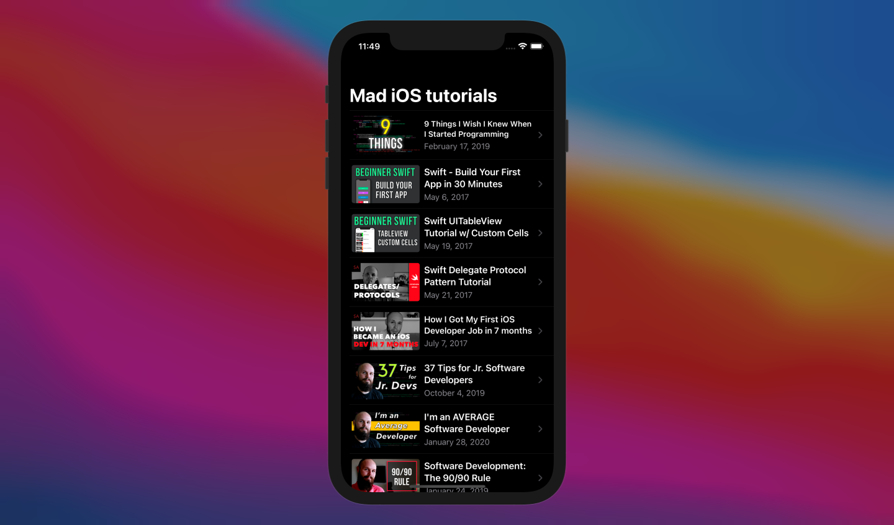
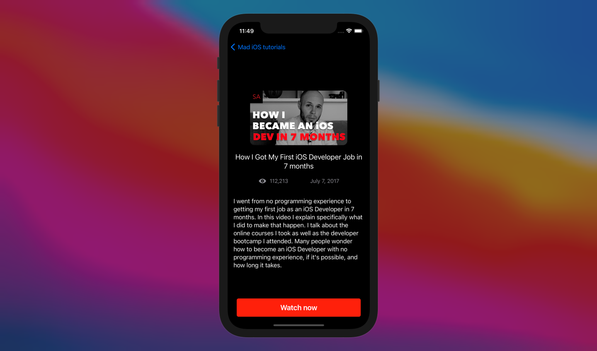
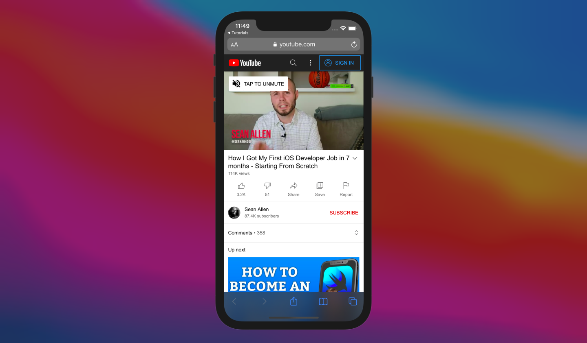

#  Tutorials App

This is a tutorial app that teaches you how to build a common user flow in which user sees a list of items initially and on tap of each item, he can view more information about particular tutorial he has selected. User tapping on "Watch now" will open default browser and go to any particular destination url to show information.

Things one can get to learn in this practice are,
* Creating Data model objects that extend Identifiable
* Creating individual cell
* Using List to load information by iterating through an array of objects
* Using NavigationView, NavigationLink and NavigationTitle
* Usage of Link to redirect user from app to default browser in order to load webpages

# Screenshots

